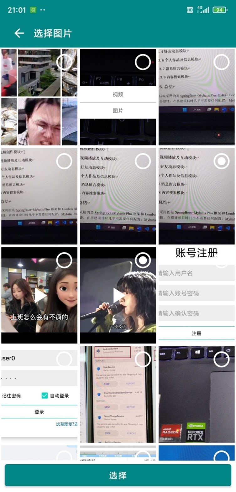
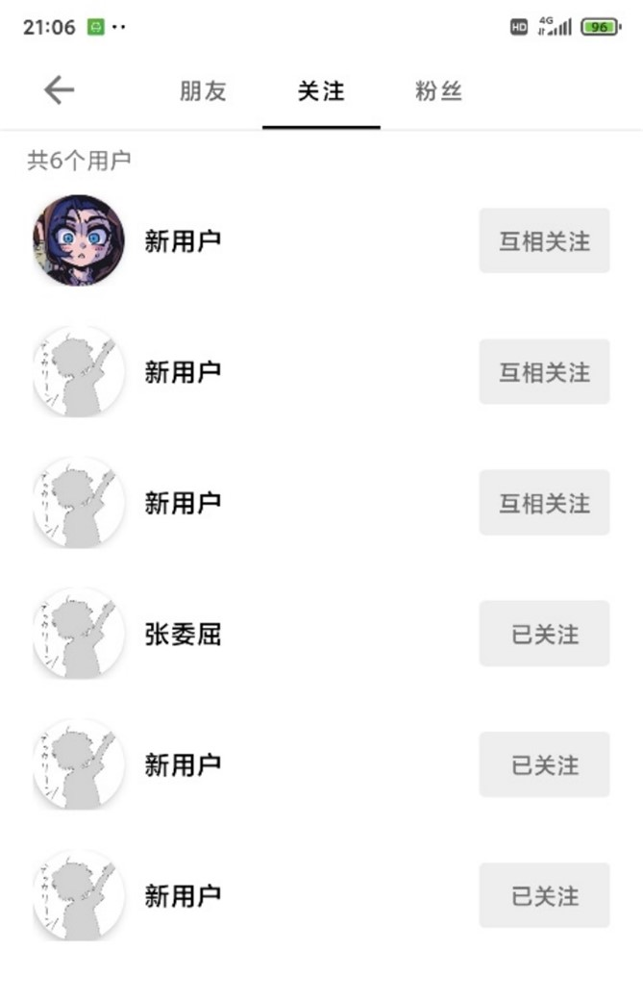

# VideoCreatePlateform
这是本人的毕业设计 视频创作平台；

APP录制视频上传到后台，从后台拉取数据播放视频或轮播图；
录制预览编码用AudioRecord，Camera2，ffmepg和OpenGLES；
解码也是ffmpeg和OpenGLES；
音乐解码和播放是ffmpeg和AudioTrack；

作者: 李凤强

下面是界面图，下拉下拉切换，播放效果类似抖音，有评论和点赞，下面有预览图，主要功能体现在APP端

首页播放

相机拍照录像相册

朋友圈

评论

消息

我的

关注

后台界面，没啥特色，随便上传几张

